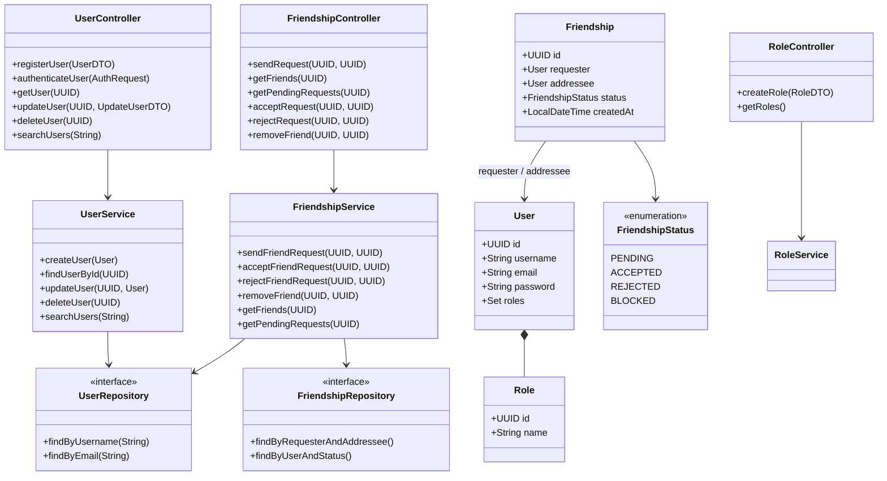
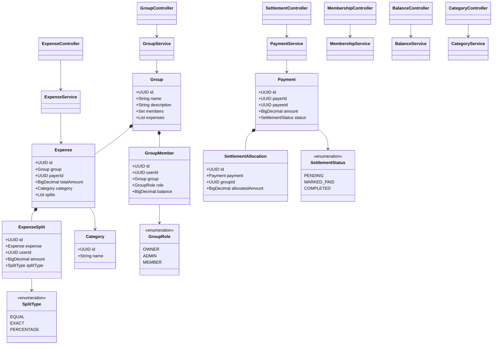
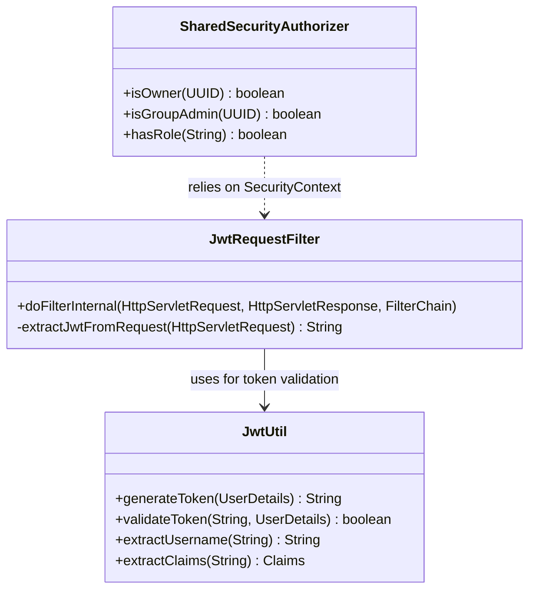
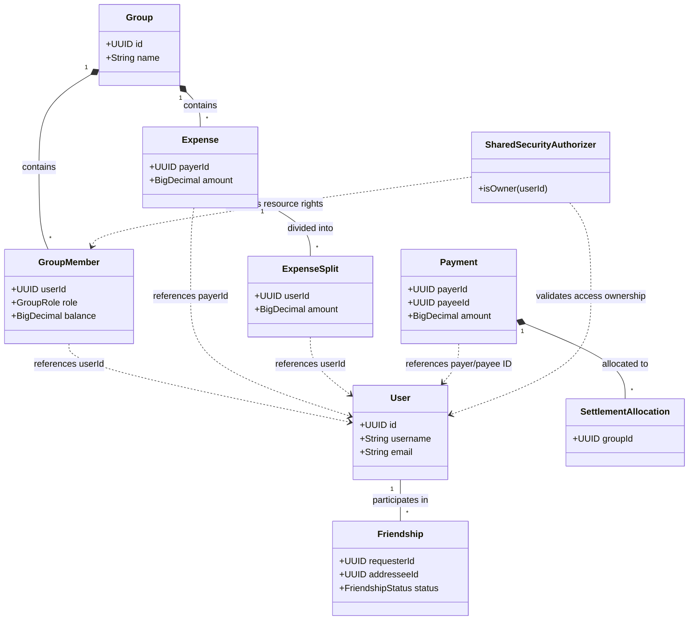

# Splitz System Class Diagrams

This document contains comprehensive class diagrams for the three primary components of the Splitz application: `user-service`, `expense-service`, and `common-security`. It concludes with a high-level bird's eye view connecting all domains.

## 1. User Service
The `user-service` is responsible for handling user authentication, profile management, role-based access, and friendship networks.

## 2. Expense Service
The `expense-service` tracks groups, manages shared expenses, calculates splits among members, and records settlement payments. It operates using logical references to user IDs, keeping domains loosely coupled.

## 3. Common Security
The `common-security` module is shared across microservices. It intercepts HTTP requests, parses JWT tokens, and evaluates domain-driven security rules (like Identity-based and Resource-based Ownership).

## 4. Bird's Eye View (Whole System)
This macroscopic diagram links together the core entities across all the services. Note how the `expense-service` entities hold a `userId` referencing the `User` entity from the `user-service`.

