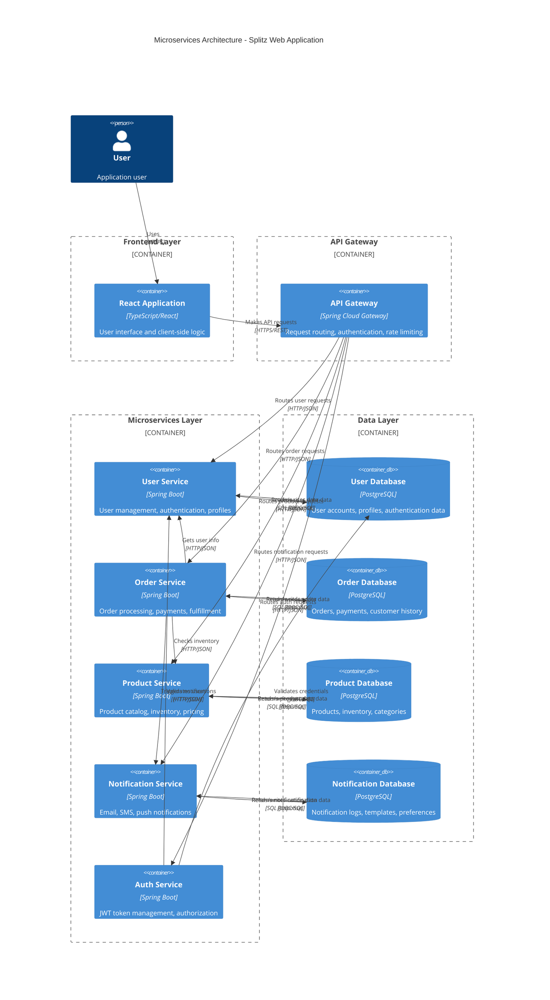

# Architectural Overview

This document provides a bird's-eye view of the Splitz project architecture, showing the complete system structure with frontend, microservices, and data layers.

## System Architecture

## Architecture Components

### Frontend Layer
- **React Application**: Single-page application built with TypeScript and React, handling user interface and client-side business logic.

### API Gateway Layer
- **API Gateway**: Spring Cloud Gateway providing centralized routing, authentication, rate limiting, and cross-cutting concerns.

### Microservices Layer
- **User Service**: Handles user registration, profile management, and authentication data.
- **Order Service**: Processes orders, payments, and fulfillment workflows.
- **Product Service**: Manages product catalog, inventory, and pricing information.
- **Notification Service**: Handles email, SMS, and push notifications.
- **Auth Service**: Manages JWT tokens, authentication, and authorization.

### Data Layer
- **User Database**: PostgreSQL database for user accounts and authentication data.
- **Order Database**: PostgreSQL database for orders, payments, and customer history.
- **Product Database**: PostgreSQL database for products, inventory, and categories.
- **Notification Database**: PostgreSQL database for notification logs and templates.

## Data Flow

1. **User Request**: User interacts with React frontend via HTTPS
2. **API Gateway**: Routes requests to appropriate microservices via HTTP/JSON
3. **Service Processing**: Each microservice handles its business logic
4. **Database Operations**: Services communicate with their respective PostgreSQL databases via JDBC/SQL
5. **Response Flow**: Data flows back through the same path to the user

## Key Architectural Patterns

- **Microservices**: Each service is independent with its own database
- **API Gateway**: Central entry point for all client requests
- **Database Per Service**: Each microservice owns its data for independence
- **REST Communication**: Services communicate via HTTP/JSON APIs
- **Authentication**: JWT-based authentication managed by the Auth Service