# Splitz Backend Architecture

High-level class-level architecture of the Splitz backend.

## System Overview

Splitz is a Spring Boot multi-module backend with **two main services**:

- **User Service** – user identity, authentication, and friendships
- **Expense Service** – groups, expenses, settlements, categories, and balances

A shared **`common-security`** module provides cross-cutting JWT and authorization utilities consumed by both services.

```mermaid
classDiagram
    direction TB

    %% ==================== COMMON SECURITY ====================
    namespace common-security {
        class JwtUtil {
        }
        class JwtRequestFilter {
        }
        class SharedSecurityAuthorizer {
        }
    }

    %% ==================== USER SERVICE ====================
    namespace user-service {
        %% Controllers
        class UserController {
        }
        class FriendshipController {
        }

        %% Services
        class UserService {
        }
        class FriendshipService {
        }

        %% Models
        class User {
        }
        class Role {
        }
        class Friendship {
        }
        class FriendshipStatus {
            <<enumeration>>
        }
    }

    %% ==================== EXPENSE SERVICE ====================
    namespace expense-service {
        %% Controllers
        class ExpenseController {
        }
        class GroupController {
        }
        class BalanceController {
        }
        class SettlementController {
        }
        class CategoryController {
        }

        %% Services
        class ExpenseService {
        }
        class GroupService {
        }
        class BalanceService {
        }
        class SettlementService {
        }
        class CategoryService {
        }
        class FriendshipSettlementService {
        }
        class SplitCalculator {
        }

        %% Client
        class UserClient {
            <<interface>>
        }
        class WebClientUserClient {
        }

        %% Models
        class Group {
        }
        class GroupMember {
        }
        class GroupRole {
            <<enumeration>>
        }
        class Expense {
        }
        class ExpenseSplit {
        }
        class Settlement {
        }
        class SettlementStatus {
            <<enumeration>>
        }
        class FriendshipSettlement {
        }
        class Category {
        }
        class SplitType {
            <<enumeration>>
        }

        %% Strategy
        class SplitStrategy {
            <<interface>>
        }
        class EqualSplitStrategy {
        }
        class ExactSplitStrategy {
        }
        class PercentageSplitStrategy {
        }
        class SharesSplitStrategy {
        }
        class AdjustmentSplitStrategy {
        }
        class RemainderHandler {
        }
        class SplitResult {
        }
    }

    %% ==================== CROSS-SERVICE CLIENT ====================

    %% ==================== INTER-SERVICE RELATIONSHIPS ====================

    %% Common security used by both services
    JwtUtil --> JwtRequestFilter : signs / verifies
    JwtRequestFilter --> SharedSecurityAuthorizer : relies on
    SharedSecurityAuthorizer ..> UserController : @PreAuthorize
    SharedSecurityAuthorizer ..> FriendshipController : @PreAuthorize
    SharedSecurityAuthorizer ..> ExpenseController : injected
    SharedSecurityAuthorizer ..> GroupController : injected
    SharedSecurityAuthorizer ..> BalanceController : @PreAuthorize

    %% User Service
    UserController --> UserService : uses
    FriendshipController --> FriendshipService : uses
    UserService --> User
    UserService --> Role
    FriendshipService --> Friendship
    FriendshipService --> User
    User ..> Role : has roles
    Friendship ..> User : requester / addressee
    Friendship ..> FriendshipStatus : enum

    %% Expense Service
    ExpenseController --> ExpenseService : uses
    GroupController --> GroupService : uses
    BalanceController --> BalanceService : uses
    SettlementController --> SettlementService : uses
    CategoryController --> CategoryService : uses

    %% Services to Models
    ExpenseService --> Expense
    ExpenseService --> ExpenseSplit
    ExpenseService --> SplitCalculator : uses
    GroupService --> Group
    GroupService --> GroupMember
    GroupService --> UserClient : calls user-service
    BalanceService --> Expense
    BalanceService --> Settlement
    BalanceService --> FriendshipSettlement
    BalanceService --> GroupMember
    BalanceService --> UserClient : calls user-service
    SettlementService --> Settlement
    CategoryService --> Category
    FriendshipSettlementService --> FriendshipSettlement

    %% Group relationships
    Group "1" --> "0..*" GroupMember : contains
    Group "1" --> "0..*" Expense : contains
    Group "1" --> "0..*" Settlement : contains
    Expense "1" --> "0..*" ExpenseSplit : splits
    Expense --> Category : optional
    GroupMember ..> GroupRole : enum
    ExpenseSplit ..> SplitType : enum
    Settlement ..> SettlementStatus : enum
    Expense --> Group : belongsTo
    Settlement --> Group : belongsTo
    ExpenseSplit --> Expense : belongsTo

    %% Balance service delegation
    BalanceService ..> GroupService : get group context
    BalanceService ..> SettlementService : includes settlements
    BalanceService ..> FriendshipSettlementService : includes global settlements

    %% User client
    UserClient <|.. WebClientUserClient : implements
    WebClientUserClient --> UserClient

    %% Strategy pattern
    SplitCalculator --> SplitStrategy : uses
    SplitStrategy <|.. EqualSplitStrategy : implements
    SplitStrategy <|.. ExactSplitStrategy : implements
    SplitStrategy <|.. PercentageSplitStrategy : implements
    SplitStrategy <|.. SharesSplitStrategy : implements
    SplitStrategy <|.. AdjustmentSplitStrategy : implements
    SplitCalculator --> RemainderHandler : uses
    SplitCalculator --> SplitResult : returns

    %% Security expressions
    class SecurityExpressions {
    }
    SecurityExpressions --> SharedSecurityAuthorizer
    SecurityExpressions --> GroupMemberRepository
    SecurityExpressions ..> BalanceController : isGroupMember
```

---

## Module Responsibilities

### `common-security`

| Component | Role |
|-----------|------|
| `JwtUtil` | Token generation, parsing, validation, and claim extraction |
| `JwtRequestFilter` | Servlet filter that intercepts requests and sets the Spring Security context from the JWT |
| `SharedSecurityAuthorizer` | Reusable `@Component("splitzAuthorizer")` providing `isSelfOrAdmin()`, `isAdmin()`, and `getCurrentUserId()` for `@PreAuthorize` expressions |

### `user-service`

| Layer | Key Classes |
|-------|-------------|
| **Controllers** | `UserController`, `FriendshipController` |
| **Services** | `UserService`, `FriendshipService` |
| **Models** | `User`, `Role`, `Friendship`, `FriendshipStatus` |

- Manages user CRUD, search, password encoding, and role assignment.
- Handles friendship lifecycle (send, accept, reject, remove).
- Exposes a REST API consumed by the expense service via `UserClient`.

### `expense-service`

| Layer | Key Classes |
|-------|-------------|
| **Controllers** | `ExpenseController`, `GroupController`, `BalanceController`, `SettlementController`, `CategoryController` |
| **Services** | `ExpenseService`, `GroupService`, `BalanceService`, `SettlementService`, `CategoryService`, `FriendshipSettlementService`, `SplitCalculator` |
| **Models** | `Group`, `GroupMember`, `GroupRole`, `Expense`, `ExpenseSplit`, `Settlement`, `SettlementStatus`, `FriendshipSettlement`, `Category`, `SplitType` |
| **Client** | `UserClient` (interface), `WebClientUserClient` (WebClient implementation) |
| **Strategy** | `SplitStrategy` (interface), `EqualSplitStrategy`, `ExactSplitStrategy`, `PercentageSplitStrategy`, `SharesSplitStrategy`, `AdjustmentSplitStrategy`, `RemainderHandler`, `SplitResult` |

- Manages groups, expenses, settlements, and categories.
- Calculates balances (group-level and user-level) and simplifies debt graphs.
- Supports multi-currency split calculations via the strategy + remainder handler pattern.
- Calls `user-service` to resolve user-related data.

---

## Key Design Patterns

1. **Strategy Pattern** – `SplitStrategy` with multiple concrete strategies for different split types.
2. **Shared Security Module** – `SharedSecurityAuthorizer` is reused across services for consistent authorization logic.
3. **Inter-Service Client** – `UserClient` / `WebClientUserClient` abstracts calls from `expense-service` to `user-service`.
4. **Repository Abstraction** – Spring Data JPA repositories hide persistence details behind service layers.
