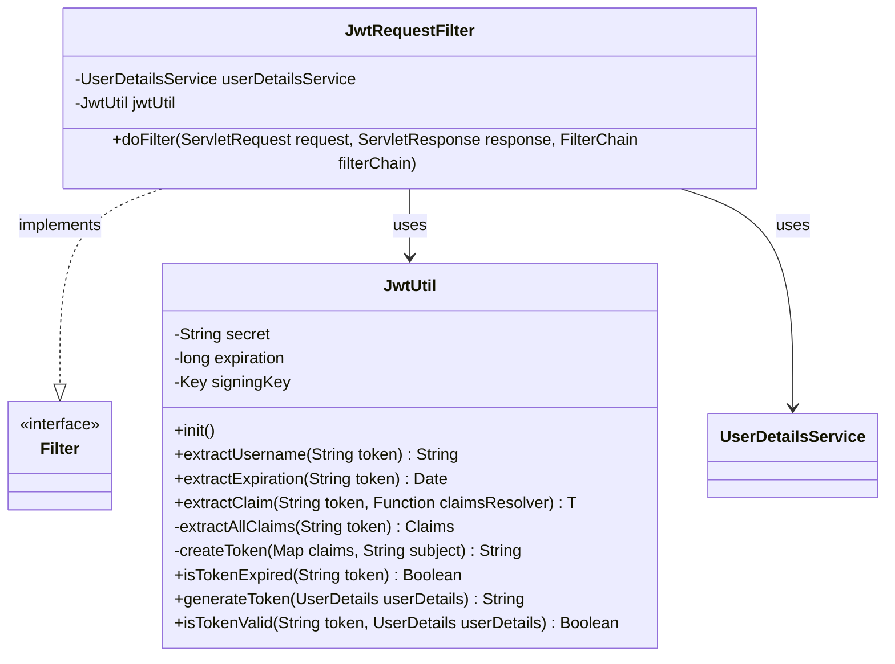

# Class Diagram: Common Security

This diagram illustrates the classes and their relationships within the `common-security` module.

## Description

- **JwtUtil**: A component responsible for handling JWT (JSON Web Token) operations, including generation, validation, and claim extraction. It uses `signingKey` derived from a Base64-encoded secret.
- **JwtRequestFilter**: A custom servlet filter that intercepts incoming HTTP requests to validate the `Authorization` header. If a valid JWT is present, it sets the authentication in the Spring Security context.
- **Dependencies**: The `JwtRequestFilter` depends on `UserDetailsService` (to load user details) and `JwtUtil` (to perform token operations).
