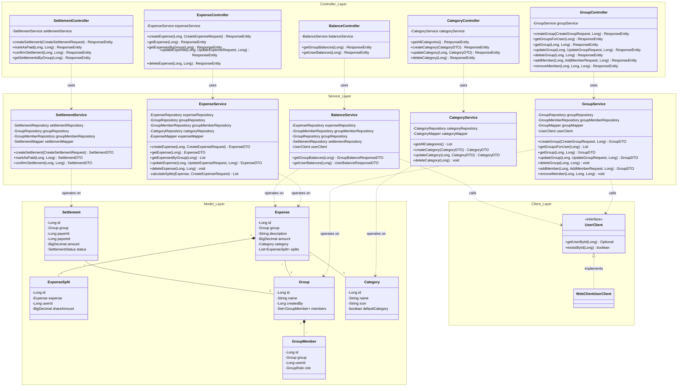

# Expense Service Class Diagram

```mermaid
classDiagram
    direction TD

    %% Layer Grouping with Namespaces
    namespace Controller_Layer {
        class ExpenseController
        class GroupController
        class BalanceController
        class SettlementController
        class CategoryController
    }

    namespace Service_Layer {
        class ExpenseService
        class GroupService
        class BalanceService
        class SettlementService
        class CategoryService
    }

    namespace Model_Layer {
        class Expense
        class ExpenseSplit
        class Group
        class GroupMember
        class Category
        class Settlement
    }

    namespace Client_Layer {
        class UserClient
        class WebClientUserClient
    }

    %% Detailed Class Definitions
    class ExpenseController {
        -ExpenseService expenseService
        +createExpense(Long, CreateExpenseRequest) ResponseEntity
        +getExpense(Long) ResponseEntity
        +getExpensesByGroup(Long) ResponseEntity
        +updateExpense(Long, UpdateExpenseRequest, Long) ResponseEntity
        +deleteExpense(Long, Long) ResponseEntity
    }

    class GroupController {
        -GroupService groupService
        +createGroup(CreateGroupRequest, Long) ResponseEntity
        +getGroupsForUser(Long) ResponseEntity
        +getGroup(Long, Long) ResponseEntity
        +updateGroup(Long, UpdateGroupRequest, Long) ResponseEntity
        +deleteGroup(Long, Long) ResponseEntity
        +addMember(Long, AddMemberRequest, Long) ResponseEntity
        +removeMember(Long, Long, Long) ResponseEntity
    }

    class BalanceController {
        -BalanceService balanceService
        +getGroupBalances(Long) ResponseEntity
        +getUserBalances(Long) ResponseEntity
    }

    class SettlementController {
        -SettlementService settlementService
        +createSettlement(CreateSettlementRequest) ResponseEntity
        +markAsPaid(Long, Long) ResponseEntity
        +confirmSettlement(Long, Long) ResponseEntity
        +getSettlementsByGroup(Long) ResponseEntity
    }

    class CategoryController {
        -CategoryService categoryService
        +getAllCategories() ResponseEntity
        +createCategory(CategoryDTO) ResponseEntity
        +updateCategory(Long, CategoryDTO) ResponseEntity
        +deleteCategory(Long) ResponseEntity
    }

    class ExpenseService {
        -ExpenseRepository expenseRepository
        -GroupRepository groupRepository
        -GroupMemberRepository groupMemberRepository
        -CategoryRepository categoryRepository
        -ExpenseMapper expenseMapper
        +createExpense(Long, CreateExpenseRequest) ExpenseDTO
        +getExpense(Long) ExpenseDTO
        +getExpensesByGroup(Long) List
        +updateExpense(Long, UpdateExpenseRequest, Long) ExpenseDTO
        +deleteExpense(Long, Long) void
        -calculateSplits(Expense, CreateExpenseRequest) List
    }

    class GroupService {
        -GroupRepository groupRepository
        -GroupMemberRepository groupMemberRepository
        -GroupMapper groupMapper
        -UserClient userClient
        +createGroup(CreateGroupRequest, Long) GroupDTO
        +getGroupsForUser(Long) List
        +getGroup(Long, Long) GroupDTO
        +updateGroup(Long, UpdateGroupRequest, Long) GroupDTO
        +deleteGroup(Long, Long) void
        +addMember(Long, AddMemberRequest, Long) GroupDTO
        +removeMember(Long, Long, Long) void
    }

    class BalanceService {
        -ExpenseRepository expenseRepository
        -GroupMemberRepository groupMemberRepository
        -GroupRepository groupRepository
        -SettlementRepository settlementRepository
        -UserClient userClient
        +getGroupBalances(Long) GroupBalanceResponseDTO
        +getUserBalances(Long) UserBalanceResponseDTO
    }

    class SettlementService {
        -SettlementRepository settlementRepository
        -GroupRepository groupRepository
        -GroupMemberRepository groupMemberRepository
        -SettlementMapper settlementMapper
        +createSettlement(CreateSettlementRequest) SettlementDTO
        +markAsPaid(Long, Long) SettlementDTO
        +confirmSettlement(Long, Long) SettlementDTO
    }

    class CategoryService {
        -CategoryRepository categoryRepository
        -CategoryMapper categoryMapper
        +getAllCategories() List
        +createCategory(CategoryDTO) CategoryDTO
        +updateCategory(Long, CategoryDTO) CategoryDTO
        +deleteCategory(Long) void
    }

    class Expense {
        -Long id
        -Group group
        -String description
        -BigDecimal amount
        -Category category
        -List~ExpenseSplit~ splits
    }

    class ExpenseSplit {
        -Long id
        -Expense expense
        -Long userId
        -BigDecimal shareAmount
    }

    class Group {
        -Long id
        -String name
        -Long createdBy
        -Set~GroupMember~ members
    }

    class GroupMember {
        -Long id
        -Group group
        -Long userId
        -GroupRole role
    }

    class Category {
        -Long id
        -String name
        -String icon
        -boolean defaultCategory
    }

    class Settlement {
        -Long id
        -Group group
        -Long payerId
        -Long payeeId
        -BigDecimal amount
        -SettlementStatus status
    }

    class UserClient {
        <<interface>>
        +getUserById(Long) Optional
        +existsById(Long) boolean
    }

    %% Relationships
    ExpenseController ..> ExpenseService : uses
    GroupController ..> GroupService : uses
    BalanceController ..> BalanceService : uses
    SettlementController ..> SettlementService : uses
    CategoryController ..> CategoryService : uses

    ExpenseService ..> Expense : operates on
    GroupService ..> Group : operates on
    BalanceService ..> Expense : operates on
    SettlementService ..> Settlement : operates on
    CategoryService ..> Category : operates on

    GroupService ..> UserClient : calls
    BalanceService ..> UserClient : calls

    UserClient <|.. WebClientUserClient : implements

    Expense "1" *-- "*" ExpenseSplit
    Expense "*" -- "1" Group
    Expense "*" -- "1" Category
    Group "1" *-- "*" GroupMember
    Settlement "*" -- "1" Group
```
