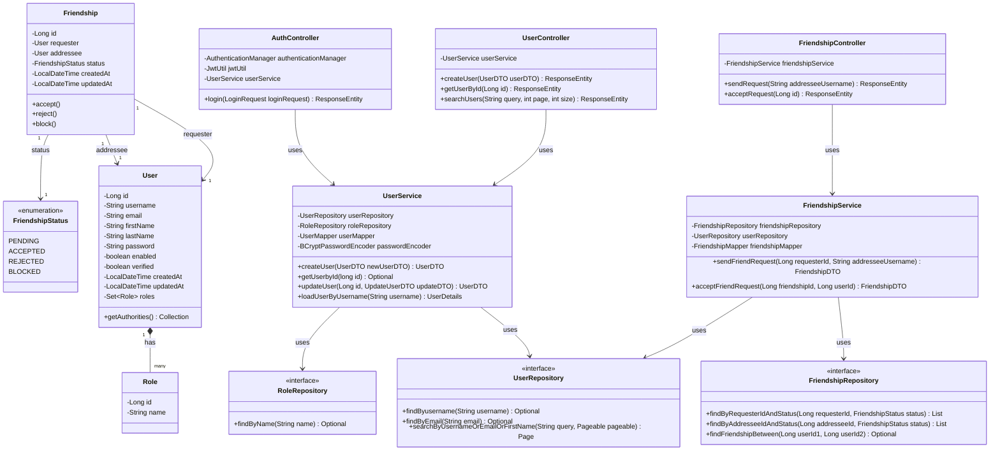

# Class Diagram: User Service

This diagram provides a detailed view of the class structures and relationships within the `user-service`.

## Description

- **Core Entities**: The service manages `User`, `Role`, and `Friendship`. `User` implements `UserDetails` for integration with Spring Security.
- **Friendship Logic**: `Friendship` tracks relationships between users with statuses managed via the `FriendshipStatus` enum.
- **Layers**:
    - **Controllers**: Handle HTTP requests and security annotations.
    - **Services**: Contain business logic and interact with repositories.
    - **Repositories**: Standard Spring Data JPA interfaces for data persistence.
    - **Mappers & DTOs**: (Omitted for brevity in diagram) Handle conversion between internal entities and external API responses.
- **Security**: The `AuthController` handles login and token generation, leveraging `JwtUtil` from the `common-security` module.
