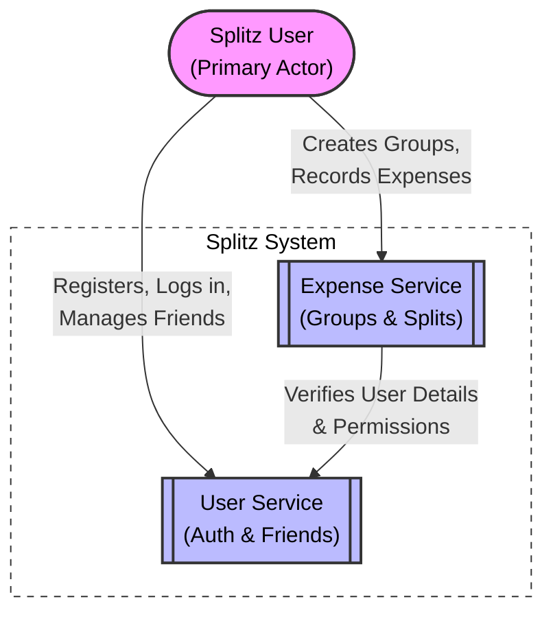

# System Context Diagram

This diagram provides a high-level overview of the Splitz system, its users, and its internal components.

## Key Components

- **Splitz User**: The primary actor who interacts with the system via a client application (not shown).
- **User Service**: The core service for identity management and social features.
- **Expense Service**: The primary business logic service for the splitting functionality.
- **Internal Interaction**: The Expense Service relies on the User Service to validate members and permissions.
