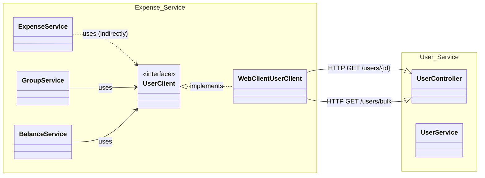

# Cross-Service Relationships

This diagram illustrates the class-level interaction between the **Expense Service** and the **User Service**.

## Interaction Details

### UserClient Interface

The `UserClient` interface in the Expense Service abstracts the communication with the User Service. This allows the business logic (like `GroupService` and `BalanceService`) to remain decoupled from the specific communication mechanism.

### WebClientUserClient Implementation

The `WebClientUserClient` is the concrete implementation that uses Spring's `WebClient` to make RESTful calls to the User Service endpoints:

- `GET /users/{id}`: To fetch detailed information for a single user.
- `GET /users/bulk`: To fetch information for multiple users simultaneously (used for balancing and group member lists).

### Security & Propagation

All cross-service calls are authenticated. The `WebClient` in the Expense Service is configured to propagate the current user's JWT token to the User Service, ensuring that the request is authorized and the context is preserved.
