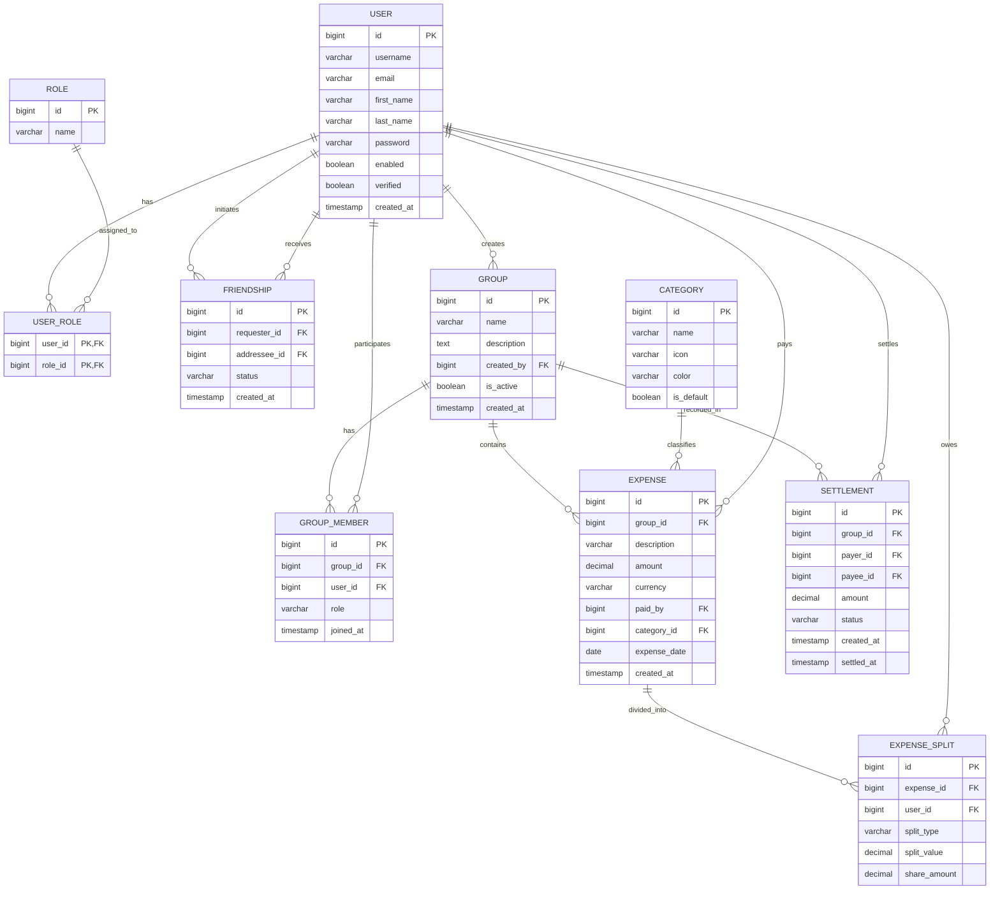

# Unified Entity Relationship Diagram (ERD)

This diagram represents the combined data model of the Splitz system, including both the `user-service` and `expense-service` entities and their relationships.

## Entity Descriptions

### User Service

- **USER**: Core user identity and authentication data.
- **ROLE**: System-level roles (e.g., ROLE_USER, ROLE_ADMIN).
- **FRIENDSHIP**: Social connections between users with states (PENDING, ACCEPTED, etc.).

### Expense Service

- **GROUP**: Shared spaces for tracking collective expenses.
- **GROUP_MEMBER**: Junction table linking users to groups with specific roles (e.g., ADMIN, MEMBER).
- **CATEGORY**: Classification for expenses (e.g., Food, Travel).
- **EXPENSE**: A single transaction recorded within a group.
- **EXPENSE_SPLIT**: Detailed breakdown of how an expense is shared among users (supports fixed, percentage, or share-based logic).
- **SETTLEMENT**: Records of payments made between users to resolve debts within a group.

## Cross-Service Integration

The `expense-service` maintains logical references to `user-service` via `user_id` fields (e.g., `created_by`, `paid_by`, `payer_id`). These are not enforced by database-level foreign keys as the services reside in separate databases.
