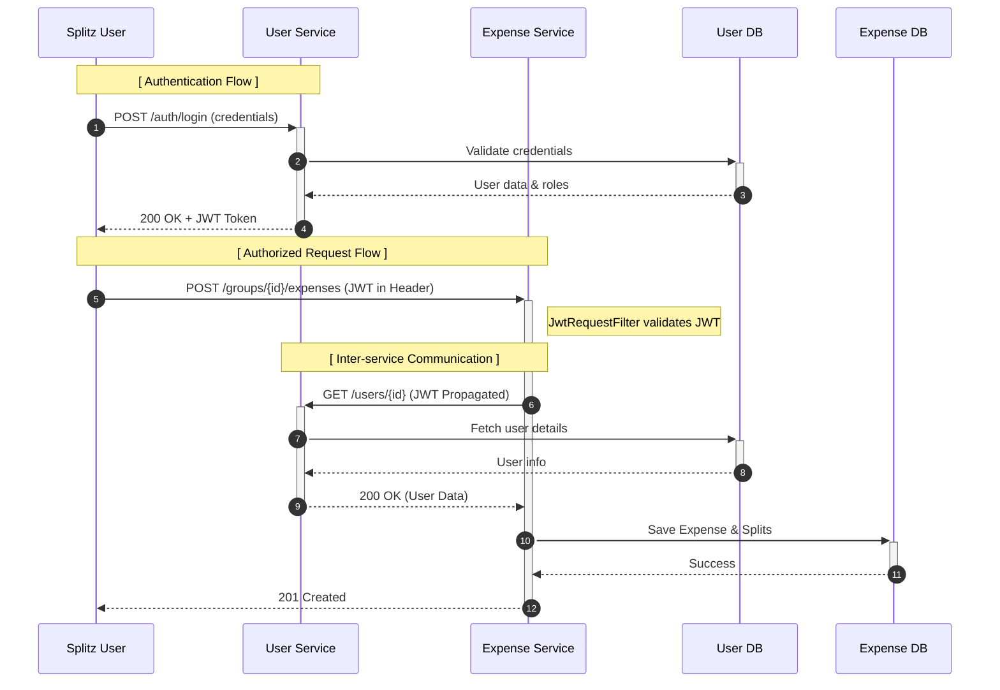

# Service Interaction & Security Diagram

This diagram illustrates the authentication flow and how the JWT is propagated between services.

## Security Mechanism

- **JWT (JSON Web Token)**: Used for stateless authentication across the system.
- **Common Security Module**: Both services use the `common-security` library, which provides:
  - **JwtUtil**: For token generation (User Service) and validation (both).
  - **JwtRequestFilter**: A Spring Security filter that extracts and validates the JWT from the `Authorization` header.
- **Token Propagation**: When the Expense Service needs to call the User Service, it uses a `WebClient` configured with an `ExchangeFilterFunction` to automatically attach the current user's JWT to the outgoing request.
