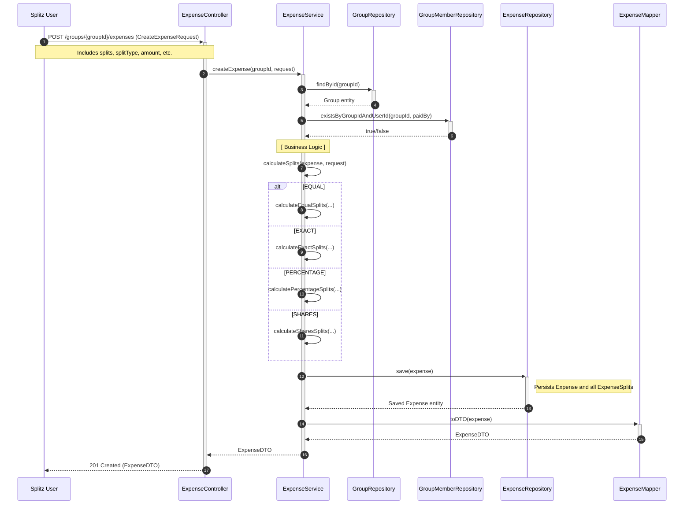

# Sequence Diagram: Advanced Split Logic

This diagram details the process of creating an expense with advanced split logic (EQUAL, EXACT, PERCENTAGE, SHARES, ADJUSTMENT).

## Flow Description

1. **Request Initiation**: The user sends a request to create an expense, providing the amount, payer, and a list of splits with a specific `splitType`.
2. **Validation**: The service verifies that the group exists and that the payer is a member of that group.
3. **Split Calculation**: Depending on the `splitType`, the service invokes the corresponding calculation method:
    - **EQUAL**: Divides the amount evenly among all split participants, handling remainders by adjusting the first split.
    - **EXACT**: Verifies that the sum of provided exact amounts matches the total expense amount.
    - **PERCENTAGE**: Calculates shares based on percentages and ensures the total sum is 100%.
    - **SHARES**: Calculates amounts based on a proportional distribution of total shares.
4. **Persistence**: The `Expense` entity, containing the list of `ExpenseSplit` entities, is saved in a single transaction.
5. **Response**: The saved entity is mapped to a DTO and returned to the client.
