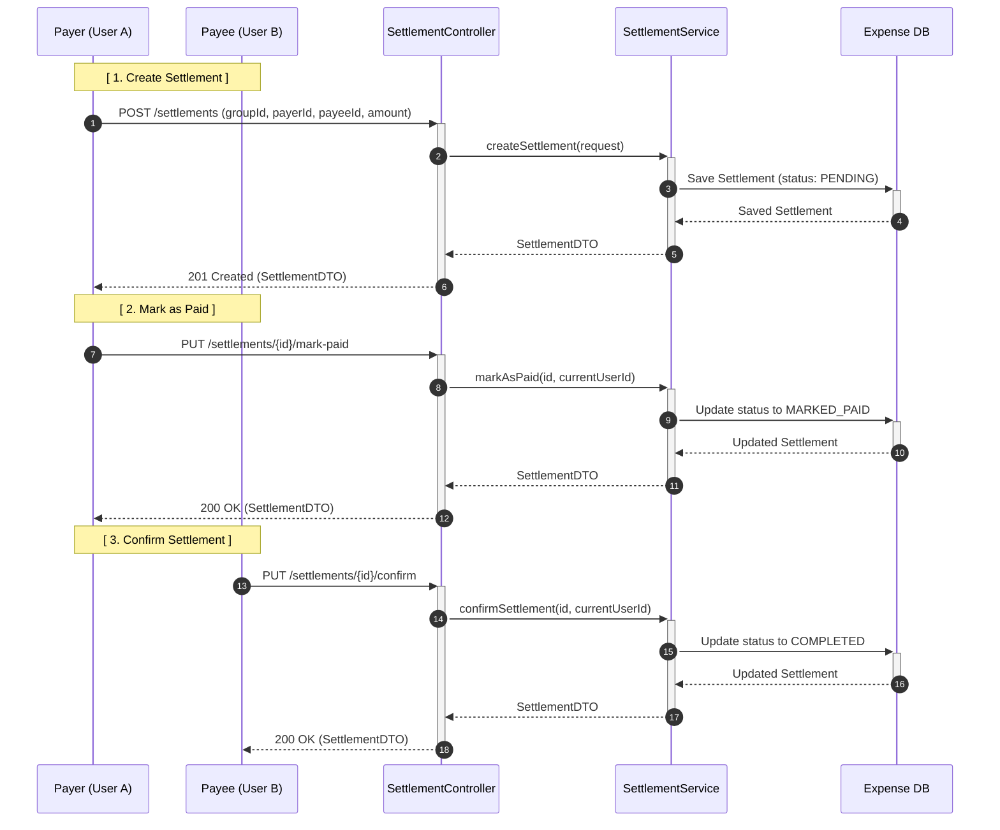

# Sequence Diagram: Settlement Flow

This diagram illustrates the lifecycle of a settlement between two group members, including creation, payment notification, and final confirmation.

## Flow Description

1.  **Creation**: A group member (the payer) creates a settlement record to indicate they intend to pay a debt to another member (the payee). The settlement starts in the `PENDING` state.
2.  **Payment Notification**: Once the payer has transferred the funds (outside of the system), they call the `mark-paid` endpoint. The status transitions to `MARKED_PAID`, and the `marked_paid_at` timestamp is recorded.
3.  **Confirmation**: The payee verifies they have received the funds and calls the `confirm` endpoint. The status transitions to `COMPLETED`, the `settled_at` timestamp is recorded, and the debt is considered officially resolved within the system.

## Business Rules

-   **Payer Authorization**: Only the designated payer can mark a settlement as paid.
-   **Payee Authorization**: Only the designated payee can confirm a settlement.
-   **Status Transition**: 
    -   `PENDING` -> `MARKED_PAID`
    -   `MARKED_PAID` -> `COMPLETED`
-   **Group Membership**: Both payer and payee must be active members of the group specified in the settlement.
